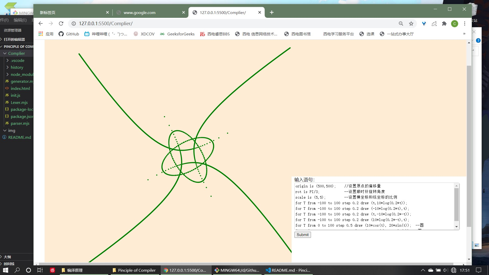

## 简单的绘图语言
XDU编译原理的大作业，代码扔库里了，给有缘人（当然指学习借鉴，毕竟我这个也是仔细研究了隔壁的一个大哥的代码才弄出来的orz

JavaScript实现，界面打点用`D3`实现
### 目录
    
    |—— node_modules
    |—— history
    | generator.mjs
    | Lexer.mjs
    | parser.mjs
    | init.js
    | index.html
    | package.json

### 模块 / 说明
- 词法分析器`Lexer.mjs`、语法分析器`parser.mjs`、语义分析+坐标生成`generator.mjs`、界面初始化`init.js`。
    - 文件链接使用 ES6
    - **Lexer** → 记号流 → **parser** → 语法树object →**generator**→ 坐标
    - **init** → 初始化页面 →
- `node_module`放着`d3`库
- `history`放着可使用nodeJS进行控制台调试的历史版本。（查看Lexer产生的生成记号流和parser产生的语法树）

### 语法
- 初始化
    `origin is (<x_value>,<y_value>);`
    `default: (0,0)`
- 旋转系数
    `rot is <angle_value>;`
    `default: 0°`
- 缩放系数
    `scale is (<x_value>,<y_value>);`
    `default: 1:1` `(PS:一比一啥都看不见就是了)`
- 循环打点
    `for T from <value> to <value> step <step_value> (<x_value>,<y_value>)`

只支持上面四种语句，支持的`常量`和`函数`看Lexer里的符号表吧。
┑(￣Д ￣)┍

### 运行
浏览器还不支持ES6的import，本地打开html直接使用是不OK的
- VScode：安装Live Server拓展，Go Live就可以访问对应端口运行了。
