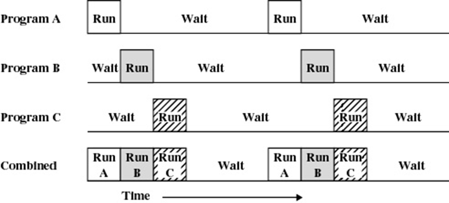

## What is an OS
- Extended machine: 隐藏了底层的复杂细节(with good Abstraction)
- Resource manager：管理计算机硬件资源
>extended machine中文翻译为拓展机，但完全不明所以。

## Operating System Definitions
**资源分配** Resource allocator
**控制程序** Control program
**内核** Kernel

## Multiprogramming(多道程序) & Multiprocessing(多进程) & Multithreading(多线程)
**多道程序**：一个资源，多个使用。

---
**多线程**：指从软件或者硬件上实现多个线程并发执行的技术。具有多线程能力的计算机因有硬件支持而能够在同一时间执行多于一个线程，进而提升整体处理性能。
>miniprocess, called threads.
>线程是CPU调度的最小单位。

**多进程**：计算机同时运行多个进程
>A process is basically a program in execution.
>进程是资源分配的最小单位，进程之间的资源是不共享的。

目前不具体深入线程和进程的学习。

## 松耦合(loosely coupled sys) & 紧耦合(Tightly coupled sys)
**loosely coupled system**: 
>each processor has its **own local memory**; processors communicate with one another through various communications lines, such as high-speed buses or telephone lines. 

简单的说，**主要特征：多个物理机器**。
典型例子有网络操作系统(Network OS)和分布式操作系统(Distributed OS)。

**Tightly coupled system**: 
> each processor has its **own local memory**; processors communicate with one another through various communications lines, such as high-speed buses or telephone lines.

主要特征有**多处理器，共享内存，共享时钟**。
典例有**SMP对称多重处理 & AMP非对称多重处理**，现在PC多数是SMP，多核有他的好处，但核多了之后，交流成本上升，性能会退化。

**AMP的非对称**体现在进程会分有`master processor`和`slave processor`的上下等级关系。由master分配任务给slave运行。

## Real-Time System
- hard 硬实时，时间不容变更。如卫星发射
- soft 软实时，时间比较有弹性。任务优先。如直播

## Computer Hardware 
I/O: 含有buffer
- buffer：缓存池，例子如快递站点，解决硬件之间速度不匹配问题。

Processor
- register：寄存器，也是缓存，解决硬件之间速度不匹配问题。
- Fetch(多个) -> uncode(多个) -> buffer -> execute

Memory

## Interrupt
中断处理器打断程序执行的正常流程，保存至一个表，后恢复。
### 一些种类
- Program: 程序中断
    运算溢出、division by zero（除数为0，可理解为程序出错
）、操作不合法、超出被分配的内存空间
- Timer：时钟中断
    CPU使用时间由系统决定，不允许某一程序占用CPU过长。（调度算法）
- I/O
- Hardware failure

### Mutiple Interrupt
多处中断（嵌套中断）

## Memory
| Register(寄存器) | Cache(高速缓存) |  main memory(主存) | magnetic disk(磁盘) |
| :----: | :----: | :----: | :----: |
|  <1KB  |  4MB   |  1-16G |较大
|  1nsec |  2nsec |   10nsec |10msec

### DMA Direct Memory Access 直接存储器提取

## Base register & Limit register
表示程序内存范围（首地址和尾地址），用于程序的relocation。
User的代码段和数据段分别用不同的`LR`和`BR`进行标记，

## Magnetic disk

## I/O
PCIe(peripheral component interconnect express)：现阶段I/O总线

## Process
>程序是死的，进程是活（正在运行）的。加载到内存内的程序才称之为进程。
- Adress space: 系统分配给进程的地址范围。内分为程序段、数据段、Context段(包含进程上下文)
- Process table: 进程表，有关进程的所有信息存储在进程表内。
- Process tree: 进程树。父进程/子进程，Window中没有进程树概念，Linux内有。
- **Interprocess communication**: 多进程通讯，通讯方式非常多（因为与环境相关，如不同CPU核）。

## Dead lock

## Files 文件系统
- directory，datafiles
- mount：挂载。linux有，windows没有。

## 现代操作系统特性
- Microkernel architecture 微内核结构：拥有一些必要的系统内核功能
    - interprocess communication.
    - basic schedule
    - memory adress
- Multithreading 多线程
    - Thread 线程
- Symmetric multiprocess 对称多处理
    - 多个处理器，共享内存和IO设备，多个处理器可实现同样的功能
- Distributed operating system 分布式
- Object-oriented design(OOD) 面向对象设计
