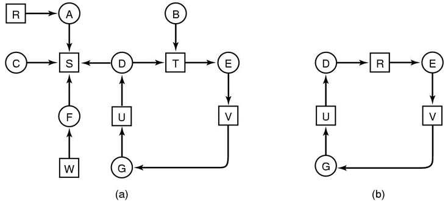

# Deadlocks
## Resources 资源
- 当资源被进程独占时容易产生死锁
- Preemptable resources 可抢占资源
    - 如内存
- Nonpreemptable resources
    - 如CD刻录机、打印机之类
## Introduction to Deadlocks
> A set of processes is deadlocked if each process in the set is waiting for an event that only another process in the set can cause
- 一个进程集里的进程在等待集内另一个进程完成（要构成等待环）
- deadlock 产生的四个条件
    - Mutual exclusion condition 互斥型
        each resource assigned to 1 process or is available
    - Hold and wait condition 保持与等待型
        process holding resources can request additional
    - No preemption condition 非抢占型
        previously granted resources cannot forcibly taken away
    - Circular wait condition 循环等待型
        must be a circular chain of 2 or more processes each is waiting for resource held by next member of the chain

- deadlock modeling
- 几种解决死锁的方法
    - Ostrich Algorithm 鸵鸟算法
        - 无为而治，出了问题重启就完事（死锁发生改率太小，不管）
        - A trade off between 便利性 and 正确性
        - 如Windows
    - 探测detect与回复recovery P443
        - 探测死锁并解决
        - 剪枝法。建模，只被申请没被占用的资源剪掉，没被剪完的剩下一个圈，即探测到死锁。
        
        - 缺点：雪上加霜，本来资源就不够用，还要占用CPU来检测
        - Recovery
            - preemption，帮他抢资源
            - rollback，回到程序的上一个check point
            - killing processes，干掉死锁中的某个进程，干掉代价最小的进程
    - dynamic Avoidance 避免死锁
        - resource trajectories 资源调配，使得系统保持安全状态 safe state。
        - Safe and Unsafe State 银行家算法
    - Deadlock prevention 硬性阻止死锁发生
        - Attacking the mutual exclusion conditon
            - 一些设备可被假脱spooled（假脱机）
            - 实时设备，如进程表，不能被假脱。
            - 
        - Attacking the Hold and Wait Condition
            - 令进程在开始开始之前就把需要的资源占掉
            - 缺点：1.在执行之前程序不一定知道自己需要什么资源。2.浪费资源
            - 解决：被调度走时放弃所有资源占用。
        - No preemption
            
        - Attacking the Circular Wait Condition
            - One way: 一个进程只用一个资源
            - Another：给所有资源编号
- Nonresource Deadlocks 非资源性死锁
    - 进程之间的死锁