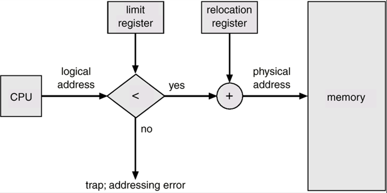
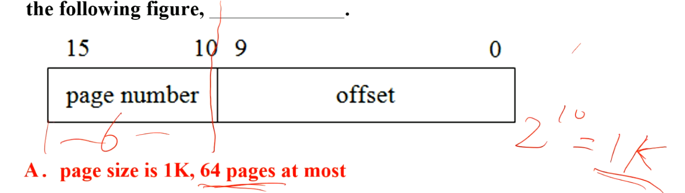
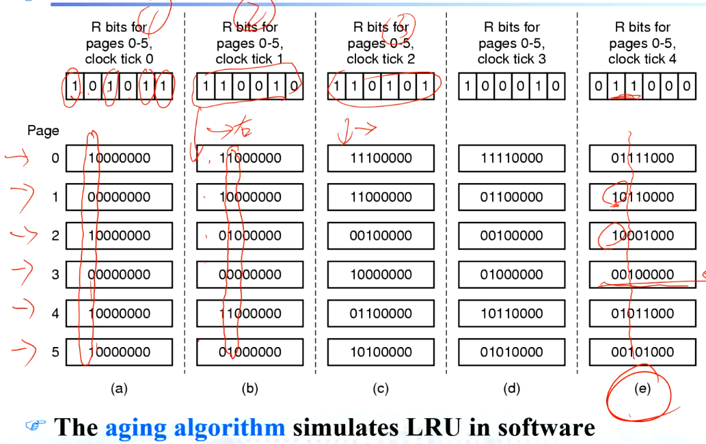
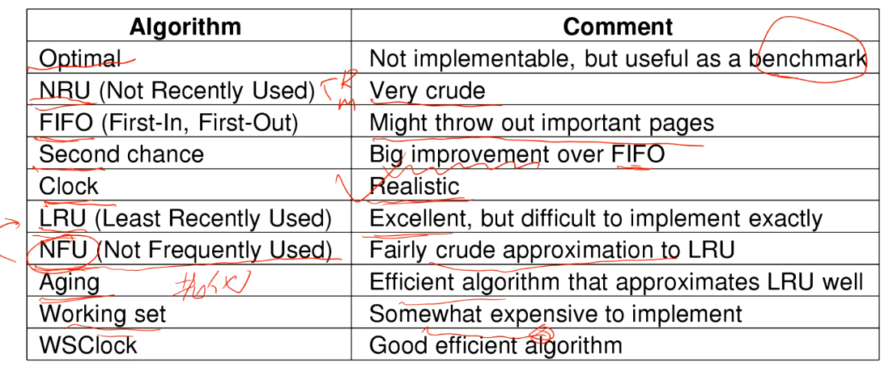
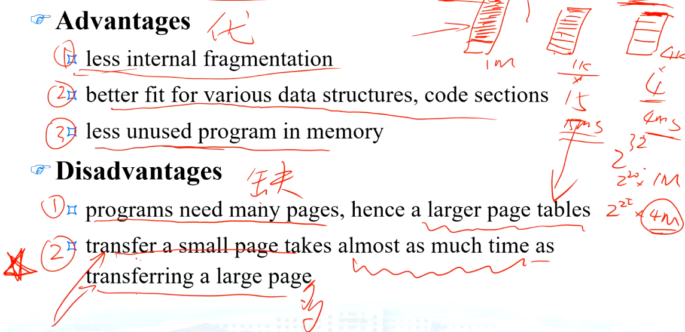
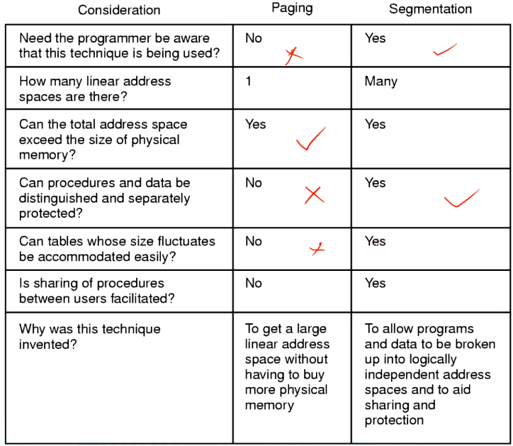
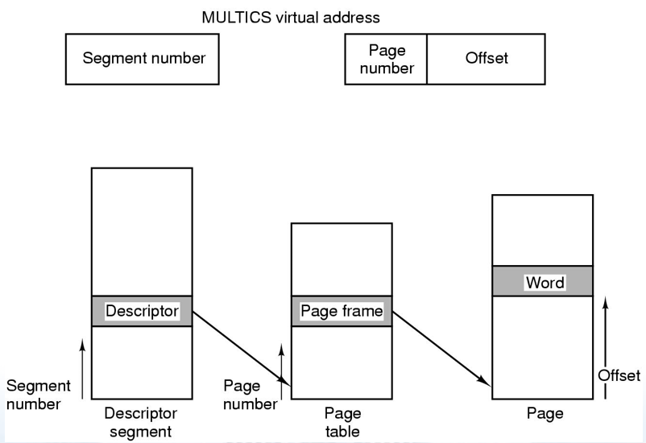

# Memory Management
## Basic memory management基本存储管理
- 段页式
- 理想存储状态：大、快、非易式(non volatile)
- Momory hierarchy 分层
    - 小、快、贵 cache
    - 中 main memory 
    - 大、慢、便宜disk storage
- Memory manager 做存储分层管理
- 内存管理系统可分为两类：
    - 将进程执行时间进程在disk和main memory之间转移(swapping and paging)的。
    - 另外一类不会
- Modeling Multiprogramming 多道程序模拟
    - I/O wait
    - 内存的增加不利于CPU利用率增加
    - 多道进程分析（**看题目**）
- Relocation and Protection
    - 用户逻辑地址 -> 物理地址
    
    - 
## Swapping 交换
因为内存的大小不足以满足所有当前活跃进程，需要进行内存管理，挪用硬盘来完成这些操作。
- 两种内存管理方式
    - **swapping 交换**
    >bringing in each process in its entirety, running it for a while, then putting it back on the disk.

    把整体进程数据在内存和硬盘之间移动。
    - **Virtual memory 虚拟内存**
    >allow programs to run even when they are only partially in main memory.

    通过不停地将进程数据段(而不是整段内存)在硬盘和内存之间腾挪，达到实际分配2M，但可以完成4M的内存需求。
- 内存管理 with Bit Maps(位图)
- 内存管理 with Linked Lists(链表)
    - **first fit**
        从头往后扫描，速度最快（平均查找长度最短）
    - **next fit** （被证实效率稍微比first fit烂一点）
        与first fit工作机制一致，但会保留上次内存分配的位置
    - **best fit**
        从头往后找，找表中最小的Hole(需要对整个表进行遍历)
        >Rather than breaking up a big hole that might be needed later, best fit tries to find a hole that is close to the actual size needed.
        it also results in more wasted memory than first fit or next fit because it tends to fill up memory with tiny, useless holes.

        容易把大功能块越薅越小
    
    - **worst fit**
        和best fit相反，总是找最大的Hole
        会把大功能块越薅越小
    - **quick fit** （综合性能最好）
        每次带**随机**性地找，没什么原则，能用就进。

## Virtual Memory
### 几个概念
- MMU 内存管理单元
- **pages 页**
虚拟内存空间的基本单元
- **page frames 页帧**
**对应的**物理内存空间的基本单元
- **page tables 页表**
    - 目的是将虚拟页面映射到页帧
    - .
    - 多级页表
        - $ 2^{32}=2^{20}\times 2^{12} = 2^{10}+2^{10}+2^{12} $
        - 
    - Page entry
        - 许多辅助位: caching disabled、reference、modified。主要是Page frame
        - 练习题
            
- Translation Lookaside Buffer(**TLB**) 转换检测缓冲区 
    TLB为CPU中的一种缓存，有固定空间槽用于缓存page table entry
    - 多数程序倾向于使用某些常用的页，称热页 (大概占20%)。
    - 热页也是动态变化的
- Inverted page tables 反向页表
    - 对于64位系统，查表级数过多，查找性能下降
    - 反向页表，根据物理地址查找虚拟地址
### Page Replacement Algorithms 页面调度算法
- 解决**让哪个页面退出**的问题
- 尽量不选热页
- Modified页必须留下
> page replacement类似问题：内存cache，web sever都会用带这些算法。
- **Not recently Used (NRU) 最近未使用**
    - 每一页有reference bit，modified bit
    - 没被用、没被改 <-cold
    - 没被用、改过
    - 用、没被改
    - 用、改过 <-hot
- **FIFO (first in first out)**
- **Second chance page replacement algorithm 二次机会**
    - 单链队列
    - reference为0，先给一次机会，第二次还是0就踢出
- **The clock page replacement algorithm**
    - 类似循环链表
    属二次机会的改进，页面不用挪位，指针移动。
- **Least recently used (LRU) 最近最少使用**
    - 选择最近最久未使用的页面予以淘汰
    - 缺点：必须维护链表，每个页项都有一个计数器，代价过大
    - 硬件模拟LRU
    - 软件模拟LRU
    
- **NFU (Not Frequently Used)**
- **Aging**
- **the work set**
    >Demand paging (请求调页): pages are loaded only on demand, not in advance.
    Working set: the set of pages that a process is currently using.
    - 工作集更新维护负担大
- **the work set clock**
一个小结

### Design issues for paging systems
#### Local/Global Allocation Policies 局部/全局分配策略
- 局部不易抢占其他进程空间，但可能会调度频繁性能下降
- 分配策略选择需要考虑**进程体量**
#### Load Control
- PFF page fault frequency 页面失效频率
    - “腾不出内存的问题”
- Solution: 减少竞争内存的进程
    - 把一些内存转移到disk中
    - 重新考虑多道程序的个数（*degree*）
#### page size
- “一个small page的大小多少才合适？”
- 一般 4K or 8K
优缺点

### Implementation issues
- page fault handling (in details)
- Backing Store 后备储存器
    - “怎么在硬盘里存？”
    (a) 静态，会进行shadow copy，地址空间一一互斥对应，阴影也会在disk中占有空间
    (b) 动态，没有shadow copy

### Segmentation 分段
**分清分页和分段的区别**

- 
- 段页式
    - 段太大的话，要将他们整段保存在内存里比较困难
    - **MULTICS**介绍
    >MULTICS, combine the advantage of paging (uniform page size and not having to keep the whole segment in memory if only part of it is being used) with the advantages of segments (ease of programming, modularity, protection, and sharing).
- 结构

- 后来MULTICS被发现并不合理（分段太多: $2^{18}$个独立分段），奔腾做了改进，段更大，数量更少。