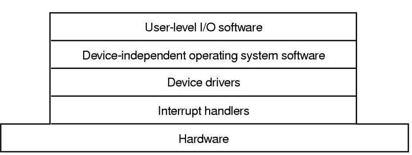
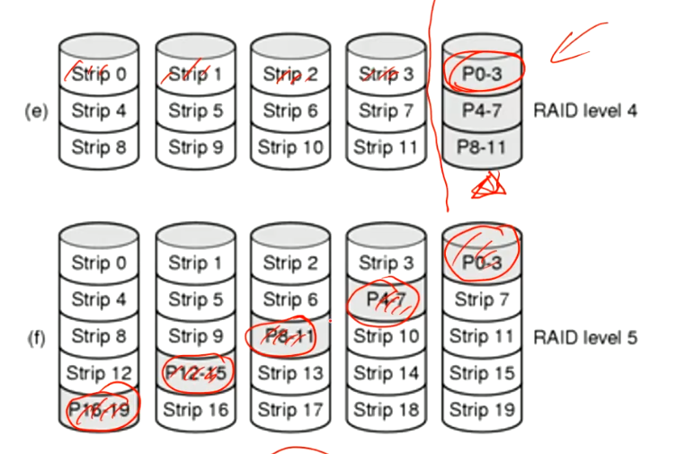

# I/O
## IO硬件原理
几类设备分类
- Block device 
    - 固定大小，且有自身地址
    - 各个设备可独立读写其他设备
    - 如Disks(硬盘)
- Character device
    - 发出或接收用户信息流
    - 无法定址，也没有查找操作
    - 如打印机，鼠标，网络接口
- 其他设备，如时钟

- I/O ports IO端口
- memory-mapped IO
    - 

- DMA direct memory access
    - CPU需要设备控制器
- Interrupts Revisited
## I/O软件原理
- 驱动
    - device independence，程序不需要关心硬件内部操作去使用IO
    - Uniform naming
    - error handling
    - 
    - 
    - 专用设备和通用（共享）设备
- 三类控制
    - 程序控制IO
        - 实现简单，一直占用CPU，浪费性能
    - 中断驱动IO
        - 中断设备进程
    - 使用DMA的IO
        - 用DMA缓冲区来处理IO信息，降低IO对CPU的干扰
## I/O软件层次

- Interrput Handlers
    - 中断处理被很好地隐藏
    - 
- 设备驱动
    - 控制OS和设备的通讯
    - 从前的Unix驱动与内核相统一，从MS-DOS开始，驱动被独立分开
- 驱动的uniform interface
    - 指定统一的驱动接口标准，方便新的驱动插入到OS中
- Buffering
    - 4种方式
        - 无buffer输入
        - 在用户空间进行buffer （单缓存）
        - 内核空间buffer再copy到用户空间
        - 上面两个合起来 （双缓存，稳）
            - 乒乓缓冲机制：可读->在读->可写->在写->··· 状态交替进行
---
## Disk
Disk hardware
Disk formatting
- **Hardware**
    - 磁盘：hard disks, floppy disks软盘等
        - RAID Redundant Array of Independent Disk 独立硬盘冗余阵列
            - 避免数据丢失
            - 分有level 0,1,2,3,4,5,10,01,50
            - RAID 0：内容穿插在两个disk中，一个坏了还能留一半
            - RAID 1：做两份数据在两个disk中，缺点：费盘。
            - RAID 2: 在多个盘内穿插读写，以字节甚至位作为最小单位，有额外的disks存有校验位，每个disk
            - RAID 3: RAID2升级版，吧校验位统一到一个disk里，而不是分别存在多个disk内
            - RAID 4/5
            
            - RAID 10：RAID 1+0，1和0相加，用二叉树作类比，1为父节点，0为子节点；
            - RAID 01同理。
            >实际应用上看，10更有用，坏了其中一个盘可以独立运作，而01不行
            - RADI 50类似RAID 10，不过是RAID5的升级版
    - 光盘：CD-ROMS, CD-Recoderables, DVDs, Blu-ray Disc
        - CD-ROMS：从中心到外有存储数据的螺旋线，连续地存储数据
            - 凹痕land与脊槽pit
        - DVD：双面双层（通过调整不同波长可以读同一面的不同层）
    >光盘的存储寿命会比磁盘高一点，有一次性读写的光盘，安全性比反复读写的磁盘要高
    - SSD solid state disk
---
- **Disk formatting**
    - Cylinder skew柱面斜进，起始0扇区位置错开，不在一个半径上。原因：磁盘旋转和磁头移动存在时间差，向外移动时，磁盘会转动一段距离。
---
- **Disk Arm Scheduling Algorithm 磁盘臂调度算法** (当前最优)
    解决磁盘的读写顺序问题
    - 先来先服务 FCFS first come first serve
    - 最近柱面优先，容易出现反复横跳的情况，移动磁盘臂耗费时间。
    - 电梯调度算法。能覆盖整个柱面，综合收益比上面的好一些。(当前最好)
---
- **Error Handiling** 处理错误
    柱面会留有Spare sectors，在出现Bad sector时用作数据备份。
    - 两种方式
        1. 直接把损坏扇区数据复制到Spare sectors中, 复制后的扇区称为Replacement sector. 
        2. 把bad sector后的数据往后挪一位。
        >需要频繁读写损坏扇区适合第2种，不频繁适合第1种
---
- **SSD**
    用solid-state memory来存储persistent(持久的) data
    >Unlike flash-based memory cards and USB flash drives, an SSD emulates a hard disk drive interface, thus easily replacing it in most applications.
    - 与常规硬盘相比：低功耗、无噪音、抗震动、低热量
---
- **Clocks**
    also called **timers**
    时钟也分硬件与软件
    - Hardware
        - 传统时钟：链接110-220电压线，根据交流电脉冲进行计数，50-60Hz
        - 可编程时钟：频率可程序控制(1000MHz)
    - Software
        - clock driver的任务
            - 维护系统时间
            - 防止进程越过限制时间
            - 给CPU用
            - 处理进程发出的alarm system call
            - 看门狗/监视定时器
            - >*Doing profiling, monitoring, and statistics gathering.*
    - Soft Timers
        > *A second clock available for timer interrupts*
        - 
---
- **Character-oriented terminals** 面向字符终端
    - RS-232终端硬件

- **Graphical user interfaces** 图形用户界面
    - Window / Icon / 
    - vector graphics矢量图形、raster graphics栅格图形
- **Network Terminals**
    - 通过网络连接远程用户
    - 胖终端<--->瘦终端
        - X Windows
        - SLIM Terminal：只能做简单的操作，如显示，读取等
        - 信息安全考虑
- **Power Management** 电量管理
    - 关闭不用的进程、告诉进程少用资源，尽量提升用户体验
    - 
