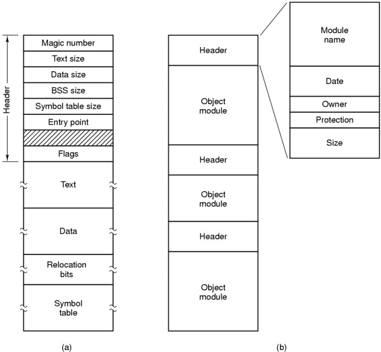

# File systems
## Files
Definition：
>The usual solution to all these problems is to store information on disks and other external media in units called **files**.
- **long-term information storage**
    - 三个必要因素：
        1. 能存储大量文件
        2. 必须能服务于进程终端
        3. 多进程能同时访问到信息
    - 数据库还是文件？根据需求判断。
        文件比数据库要慢，数据库查找速度较快
        - 文件适合大量、长期存放不需要频繁读取的数据
- **File Naming**
- **File Structure**
    1. byte sequence 数据流的方式，一个个字节往后存（UNIX,Windows）
    2. record sequence 80个字符一个卡片card
    3. tree 树形文件（商业数据）
- **File Types**
    - 按用法分类
        - sys files, user files, library files
    - 按数据格式分类
        - source, object, executable
    - 按访问控制属性分类
        - executable-only, read-only, read/write
    - 按文件逻辑结构分
        - 结构化的，
        - 非结构化的，不可通过键值获取相应信息，如图片视频等
    
    UNIX的文件管理十分宽泛，设备、硬件都按照文件处理
    - 伪文件
        - 不占用硬盘存储空间，在内存里
    

- **File Attributes** 文件属性
    
    - 

- **Implementing Files/Directory**
    
    -
    - 处理长文件名
        1. 扩大固定size：不实用，浪费空间
        2. In-line：预设好空间
        3. In a heap：文件名存在堆里，储存弹性大，效率比较差
    - Shared files
        - UNIX独有
        - 可以在不同目录下，操作同一个文件。
        - 和Windows的快捷方式的区别，"快捷方式"仅是指向该文件的符号链接，路径唯一，只能进行访问。
        - 删除操作仅当共享文件数`Count==1`时，对文件本身进行删除
- Block size
    - 越大，磁盘空间利用率越低，但传输速度越快。
    - 越小，磁盘传输速度慢，空间利用率高，查找速度快。
- File System reliability 硬盘可靠性
    - **Backup is very important**
        - >陈英豪病毒：破坏MBR硬盘主引导区。
    - **Incremental dumps 增量转储**：储存内容增量
    - 对活跃的文件系统做备份比较困难。对当前文件内容做**快照 Rapid snapshots**是一种有效的方法。
    - 备份需要be kept off-site，鸡蛋不放一个篮子里。
    - dumping 的两个策略
        - Physical dump: 物理转储
            - 全部copy一遍
            - 优点：简单，快
            - 缺点：难做精确到文件目录的转储
        - Logical dump: 
            >start at one or more specified dir and recursively (递归地) dumps all files and dir found there that have changed since some given base data.
            - 用排除法，遍历查找找未被更改的文件
            - tricky issue 棘手之处：
            >1. Since the free block list is not a file, it is not dumped and hence it must be reconstructed from scratch after all the dumps have been restored.
            >2. If a file is linked to two or more dir, it is important that the file is restored only one time.
            >3. UNIX files may contain holes. The blocks in between are not part of the file and should not be dumped and not be restored.
            >4. Special files, named files, and the like should never be dumped. UNIX把设备也当作文件
- **File Sys Performance**
    - 硬盘访问速度慢
    - Caching 
    - Block read ahead
    - reducing disk arm motion
        - 将读写的块尽可能放得紧凑
        - i-node
- **LFS Log-structed file systems 日志结构文件系统**
    - 随着CPU速度越来越快、内存越来越大
        - disk cach larger
## Examples
- CD-ROM
- CP/M Control program for microcomputers 微机控制程序
    - 经典文件系统（鼻祖）
    - 8+3文件名格式。
- MS-DOS
    - 延续了许多CP/M的特性：8+3的文件名、
- Windows 98
    - 支持长文件名、短文件名
    - MS-DOS也可以读取Win98的长文件名（向后兼容）
- Unix V7 file sys
    - 树形存储
- Linux文件系统
    - EXT2
        - superblock：记录文件系统整体信息
        - inode：记录文件属性和数据所在的block号码，一个文件一个inode
        - block：实际记录文件内容，文件太大就占多个block（再小都要占一个）
        - EXT2支持的block大小**只有**1K,2K,4K三种

            | | 1kb |2kb|3kb|
            |---|---|---|---|
            |文件最大限制|16G|256G|2T|
            |文件最大限制|2T|8T|16T|
    - EXT3
        - 一个日志文件系统
    - EXT4
    - XFS
    - VFS 虚拟文件系统
        - 管理不同文件系统的文件系统，不需要关心底层文件系统去操作文件系统