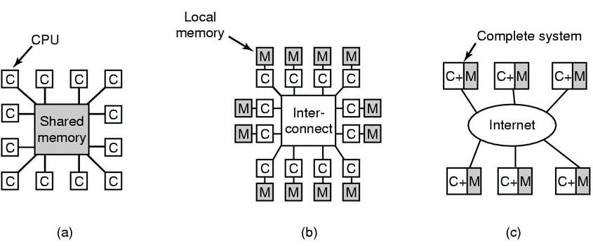
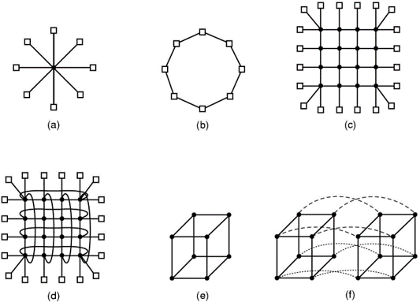
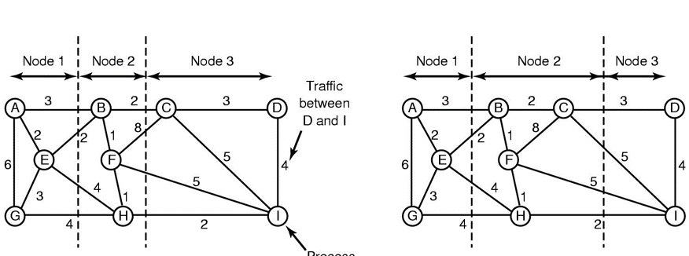
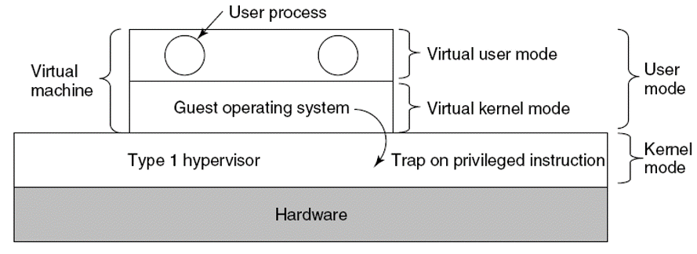
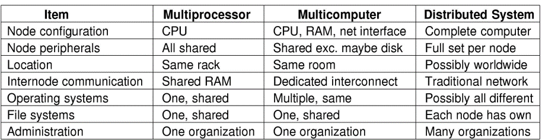
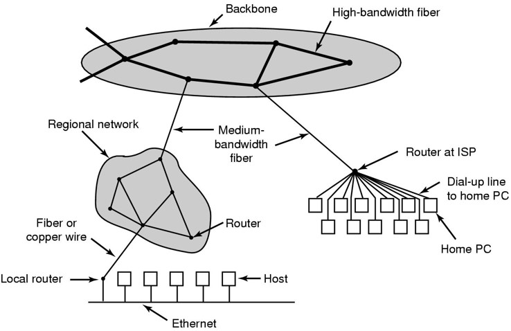

# Multiprocessor Systems 多处理系统
## Multiprocessors
更快速，高并行
- (a)share memory
- (b)multi computer(tight-coupled紧耦合)
- (c)distributed sys 分布式系统（loose-coupled松耦合）

- UMA 统一内存访问方式
每个存储器读出速度一致
    - crossbar 交叉开关：节点太多
    - multistage switching network 多级交换网络：
- NUMA 非统一内存访问方式
    - 每个CPU有各自的OS，内存被分为N份。

## Multicomputers
又称cluster computers
- 紧耦合CPUs 不共享内存，交流数据速度大概10~50 usec 
### Hardware
- inter-connect的几种拓扑方式
    1. single switch 单节点：
    2. ring ：信息流动方向固定。一个坏，整个环瘫痪，节点损坏比较难排查
    3. grid ：健壮性比较好
    4. double torus 双曲线：grid的优化版，布线麻烦
    5. cube ：综合三维拓扑，不适用于大规模网络
    6. hypercube 超立方体：多个立方体之间跳线
    
- switing schema 交换机制
    - curcuit switching 电路交换
    - wormhole routing 虫孔路由

### multicomputer scheduling
- **load Balancing**
1. Graph-theoretic deterministic algorithm
    
    _total network traffic:30 units(left), 28 units(right)_
    合理划分节点

2. **Receiver/Sender-initiated distributed heuristic algorithm**
    简单地说，就是
    太忙的节点(称为*overloaded sender*)，主动向外发出分担任务的请求；
    太闲的节点(称为*under loaded receiver*)，主动向外发出承担任务的意愿。

## Virtualization
虚拟机技术(Virtual machine technology)，通常简称虚拟化(Virtualization)

>Advantage: 
    - a failure in one virtual machine dose not automatically bring down any others.
    不怕崩系统
    - having fewer physical machines saves money on hardware and takes up less space
    省钱，不用买硬件
    - checkpointing and migrating virtual machines is much easier than normal
    - run legacy applications on operating systems no longer supported or which do not work on current hardware
    运行“遗产”软件方便
    - software development, make sure software works on different OS.

- **Hypervisor, 虚拟机监视器(VMM)**
    创建虚拟化平台，运行多个OS实例
    - VMM的 type 1
        虚拟机运行一个自认为是kernel mode的客户操作系统，但实际上在总体架构上，是User mode。
        - 这被称为virtual kernel mode。
        - such as Hyper-V, Xen, Vmware vSphere
        
    - VMM的 type 2
        在本地操作系统上运行一个用户程序
        初次启动会在virtual disk上安装一个系统
        - Vmware worksation, Parallels, VM virtualBox
- **Paravirtualization 半虚拟化**
    guest OS可以通过API来访问hypervisor

## Distributed sys

各个不同的操作系统的交接由middleware来连接。*Achieving uniformity with middleware*
- Ethernet 以太网
    1. classic Ethernet
        全部computer连接到一条Ethernet上
    2. switched Ethernet
        多个computer先连接到switch上。再由switch和Ethernet连接。
- Internet
    